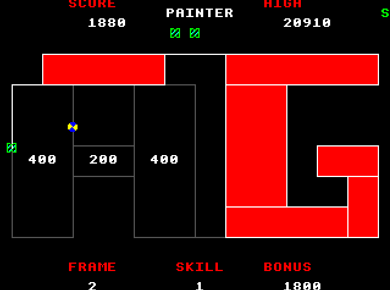
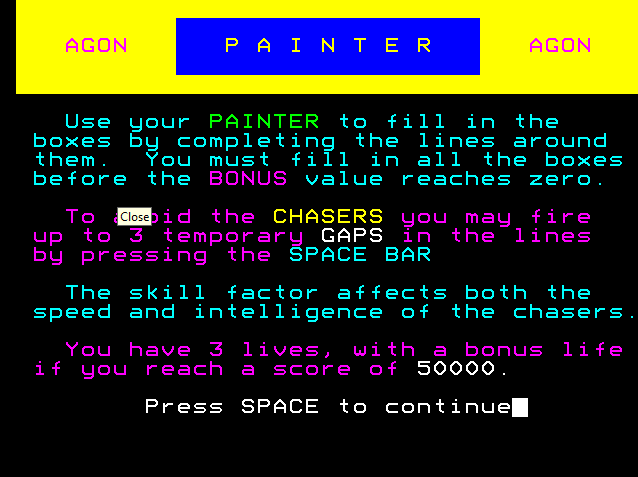

# Agon Painter
An implementation of Painter for the BBC Micro, recreated for the Agon.



Downlad the Zip file from the release package and unzip to your sdcard.

From MOS type
```
load painter
run
```


